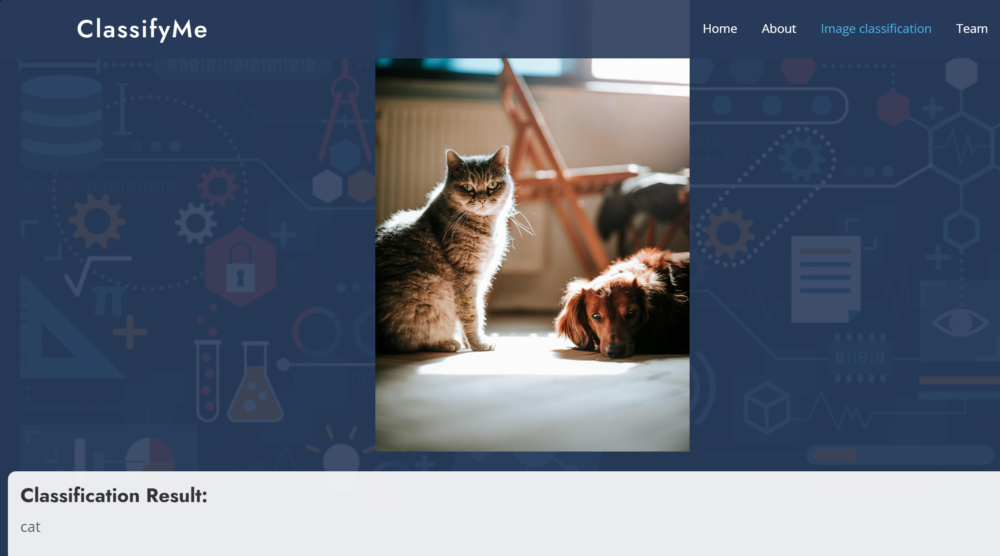
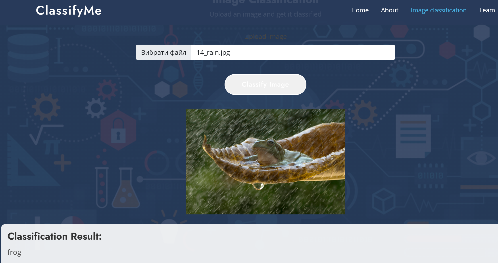

# ClassifyMe - Image Classification Web Service

## Introduction
ClassifyMe is a web-based image classification service built on the Django web platform, utilizing TensorFlow and other dependencies. The primary goal of this project is to classify images into one of the following categories: airplane, automobile, bird, cat, deer, dog, frog, horse, ship, and truck. This classification assists clients in labeling their unlabeled images, aiding their model in learning to generate new images. The project is fully configured to operate within a Docker container environment.

## The data used to train the model
[CIFAR-10](https://www.kaggle.com/competitions/cifar-10)

## Technologies
Project is mainly based on:
- **Web framework:** Django  
- **Frontend:** HTML/CSS, framework Bootstrap, JavaScript  
- **Backend:** Python  

## System Requirements
- Docker
- Docker Compose
- Python 3.12

## Installation
1. **Clone the repository:**
   ```
   git clone https://github.com/alenaporoskun/Group_4_Image_Classification_Web_Service.git
   ```
   
2. **Create a Docker image:**
    ```
   cd Group_4_Image_Classification_Web_Service
    ```
    
4. **Create a Docker image:**
   ```
   docker-compose build
   ```

5. **Run the Docker container:**
   ```
   docker-compose up
   ```
   or
   ```
   docker-compose up -d 
   ```
## Settings

1. **Install dependencies with Poetry:**  
   **Make sure Poetry is installed on your system. If not, install it using:**  
   ```
   pip install poetry
   ```

3. **Install dependencies:**  
   ```
   poetry install
   ```

5. **Set environment variables:**  
   Create an ```.env``` file in the root of the project and add the necessary environment variables if needed. For example:
```
SECRET_KEY=django-insecure-oc^irpj3$!sjy&j$@q!4mq(!7&5k2tnc1urvjz$)x2cf46fl9a
```
## Using

1. **Start the server:**  
   **If you run the project locally without Docker:**  
   ```
   poetry run python manage.py runserver
   ```
  
   **If you run the project in a Docker container:**  
   ```
   docker-compose up
   ```
   or
   ```
   docker-compose up -d 
   ```

3. **Access to the service:**
   Open your browser and follow the link
   ```
   http://127.0.0.1:8000/
   ```

   You should see the main page.


   Examples of Image Classification.
   





   
## Model description

During the search for the best model, the initial step involved selecting the type of neural network, either with or without a pretrained section. 
The following pretrained networks were tested: 
VGG16 (which showed a validation accuracy of 79%), 
MobileNet (validation accuracy: 71%), 
ResNet152 (validation accuracy: 48%), 
ResNet50 (validation accuracy: 78%). 
Following this, the focus shifted to optimizing the number, types of layers, and hyperparameters (learning rate, batch size, number of filters in convolutional layers, dropout rate) of a convolutional neural network without a pretrained section. As a result, a model was found that achieved the highest validation accuracy: 88.76%.

This model consists of 23 layers, including 6 convolutional layers with a kernel size of 4x4. It also features 3 max-pooling layers, 7 batch normalization layers, 4 dropout layers, a Flatten layer and 2 Dense layers. The total number of parameters in the model is 3,091,594. The dropout rates for the first, second, third and fourth dropout layers are 0.1, 0.2, 0.3, and 0.5, respectively. Dropout was applied to prevent overfitting. BatchNormalization layers were used to stabilize and accelerate the training process, as well as to improve the model’s generalization capability. The ReLU activation function was employed for the convolutional layers, with padding used to preserve the spatial dimensions in these layers. The first two convolutional layers contain 64 filters, the next two contain 128 filters, and the last two contain 256 filters. During training, the Adam optimizer was utilized with an initial learning rate of 0.01, which decreased over the course of training. The model was trained over 100 epochs with a batch size of 256.

### Training code for the model:

```python
model = tf.keras.Sequential()
model.add(tf.keras.layers.Conv2D(64,(4,4),input_shape=(32,32,3),activation='relu',padding='same'))
model.add(tf.keras.layers.BatchNormalization())
model.add(tf.keras.layers.Conv2D(64,(4,4),activation='relu',padding='same'))
model.add(tf.keras.layers.BatchNormalization())
model.add(tf.keras.layers.MaxPooling2D(pool_size=(2,2)))
model.add(tf.keras.layers.Dropout(0.1))
model.add(tf.keras.layers.Conv2D(128,(4,4),activation='relu',padding='same'))
model.add(tf.keras.layers.BatchNormalization())
model.add(tf.keras.layers.Conv2D(128,(4,4),activation='relu',padding='same'))
model.add(tf.keras.layers.BatchNormalization())
model.add(tf.keras.layers.MaxPooling2D(pool_size=(2,2)))
model.add(tf.keras.layers.Dropout(0.2))
model.add(tf.keras.layers.Conv2D(256,(4,4),activation='relu',padding='same'))
model.add(tf.keras.layers.BatchNormalization())
model.add(tf.keras.layers.Conv2D(256,(4,4),activation='relu',padding='same'))
model.add(tf.keras.layers.BatchNormalization())
model.add(tf.keras.layers.MaxPooling2D(pool_size=(2,2)))
model.add(tf.keras.layers.Dropout(0.3))
model.add(tf.keras.layers.Flatten())
model.add(tf.keras.layers.Dense(256, activation='relu'))
model.add(tf.keras.layers.BatchNormalization())
model.add(tf.keras.layers.Dropout(0.5))
model.add(tf.keras.layers.Dense(10))

reduce_lr = ReduceLROnPlateau(monitor='val_accuracy', factor=0.75, patience=3, min_lr=1e-6)
early_stopping = EarlyStopping(monitor='val_accuracy', patience=25, restore_best_weights=True)

model.compile(
    loss=tf.keras.losses.SparseCategoricalCrossentropy(from_logits=True),
    optimizer=tf.keras.optimizers.Adam(0.01),
    metrics=["accuracy"]
)

model.summary()

history = model.fit(x_train, y_train, epochs=100, batch_size=256, validation_data=(x_test, y_test), callbacks=[early_stopping, reduce_lr])
plot_history(history)

test_loss, test_acc = model.evaluate(x_test, y_test)
print('Validation accuracy:', test_acc)
```
  
### Training Graphs: 


### Model Diagrams:
**Model: "sequential"**

| Layer (type)                 | Output Shape       | Param #    |
|------------------------------|--------------------|------------|
| conv2d (Conv2D)              | (None, 32, 32, 64) | 3,136      |
| batch_normalization          | (None, 32, 32, 64) | 256        |
| (BatchNormalization)         |                    |            |
| conv2d_1 (Conv2D)            | (None, 32, 32, 64) | 65,600     |
| batch_normalization_1        | (None, 32, 32, 64) | 256        |
| (BatchNormalization)         |                    |            |
| max_pooling2d (MaxPooling2D) | (None, 16, 16, 64) | 0          |
| dropout (Dropout)            | (None, 16, 16, 64) | 0          |
| conv2d_2 (Conv2D)            | (None, 16, 16, 128)| 131,200    |
| batch_normalization_2        | (None, 16, 16, 128)| 512        |
| (BatchNormalization)         |                    |            |
| conv2d_3 (Conv2D)            | (None, 16, 16, 128)| 262,272    |
| batch_normalization_3        | (None, 16, 16, 128)| 512        |
| (BatchNormalization)         |                    |            |
| max_pooling2d_1 (MaxPooling2D)| (None, 8, 8, 128) | 0          |
| dropout_1 (Dropout)          | (None, 8, 8, 128)  | 0          |
| conv2d_4 (Conv2D)            | (None, 8, 8, 256)  | 524,544    |
| batch_normalization_4        | (None, 8, 8, 256)  | 1,024      |
| (BatchNormalization)         |                    |            |
| conv2d_5 (Conv2D)            | (None, 8, 8, 256)  | 1,048,832  |
| batch_normalization_5        | (None, 8, 8, 256)  | 1,024      |
| (BatchNormalization)         |                    |            |
| max_pooling2d_2 (MaxPooling2D)| (None, 4, 4, 256) | 0          |
| dropout_2 (Dropout)          | (None, 4, 4, 256)  | 0          |
| flatten (Flatten)            | (None, 4096)       | 0          |
| dense (Dense)                | (None, 256)        | 1,048,832  |
| batch_normalization_6        | (None, 256)        | 1,024      |
| (BatchNormalization)         |                    |            |
| dropout_3 (Dropout)          | (None, 256)        | 0          |
| dense_1 (Dense)              | (None, 10)         | 2,570      |

**Total params: 3,091,594 (11.79 MB)**
**Trainable params: 3,089,290 (11.78 MB)**
**Non-trainable params: 2,304 (9.00 KB)**


### Model Visualization:


